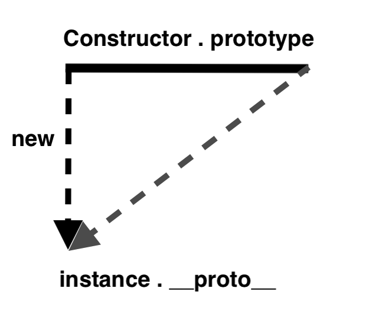

# 자바스크립트 프로토타입

- 자바스크립트는 프로토타입 기반 언어
- 어떤 객체를 '원형'으로 삼고 이를 복제(참조)함으로써 상속과 비슷한 효과를 얻음.

## 1. constructor, prototype, instance



```jsx
var instance = new Constructor();
```

- 어떤 생성자 함수(Constructor)를 new 연산자와 함께 호출하면 Constructor에서 정의된 내용을 바탕으로 새로운 인스턴스가 생성됨.
- 인스턴스에는 **proto**라는 프로퍼티가 자동으로 부여되는데, 이 프로퍼티는 Constructor의 prototype이라는 프로퍼티를 참조한다.

```jsx
var Person = function (name) {
  this._name = name;
};

Person.prototype.getName = function () {
  return this._name;
};

var suzi = new Person("Suzi");
suzi.__prototype__.getName(); //undefined

Person.prototype === suzi.__proto__; //true
```

- 어떤 함수를 '메서드로서' 호출할 때는 메서드명 바로 앞의 객체가 곧 this
- suzi.**prototype**.getName() 에서 getName 함수 내부의 this는 suzi.**proto** 라는 객체가 됨. 이 객체 내부에는 name 프로퍼티가 없으므로 찾고자하는 식별자가 정의되지 않아 undefined 반환

```jsx
var suzi = new Person("Suzi");
suzi.getName(); // Suzi
```

- **proto** 생략가능, 생략하게 되면 suzi 인스턴스를 가리키게 됨.
- 생성자 함수의 prototype에 어떤 메서드나 프로퍼티가 있다면 인스턴스에서도 해당 메서드나 프로퍼티에 접근 가능

## 2. constructor 프로퍼티
- 원래의 생성자 함수(자기자신)을 참조
- 인스턴스로부터 그 원형이 무엇인지 알 수 있는 수단

### 다양한 constructor 접근 방법
```jsx
var Person = function (name) {
  this._name = name;
};

var p1 = new Person('사람1'); // {name: "사람1"} true
var p1Proto = Object.getPrototypeOf(p1);
var p2 = new Person.prototype.constructor('사람2'); // {name: "사람2"} true
var p3 = new p1Proto.constructor('사람3'); // {name: "사람3"} true
var p4 = new p1.__proto__.constructor('사람4'); // {name: "사람4"} true
var p5 = new p1.constructor('사람5'); // {name: "사람5"} true

[p1, p2, p3, p4, p5].forEach(function (p) {
      console.log(p, p instanceof Person);
});
```

- 동일한 대상을 가르킴
```jsx
[Constructor]
[instance].__proto__.constructor
[instance].constructor
Object.getPrototypeOf([instance]).constructor
[Constructor].prototype.constructor
```

- 동일한 대상을 가르킴
```jsx
[Constructor].prototype
[instance].__proto__
[instance]
Object.getPrototypeOf([instance])
```

## 3. 메서드 오버라이드
- 오버라이드 = 덮어쓰기
- 메서드위에 메서드를 덮어 씀.
- 원본을 제거하고 다른 대상으로 교체하는 것이 아닌, 원본이 그대로 있는 상태에서 다른 대상을 그 위에 얹음.
- 가까운 대상인 자신의 프로퍼티를 검색하고, 없으면 __proto__ 에서 찾기 때문.
```jsx
var Person = function (name) {
      this.name = name;
};

Person.prototype.getName = function () {
  return this.name;    
};

var iu = new Person('지금');
iu.getName = function () {
      return '바로' + this.name;
};

console.log(iu.getName()); // 바로 지금

//프로토타입의 메서드에 접근 예
console.log(iu.__proto__.getName.call(iu)); //지금
```

## 4. 프로토타입 체인
- 자바스크립트는 특정 객체의 프로퍼티나 메소드에 접근시 객체 자신의 것뿐 아니라 proto가 가리키는 링크를 따라서 자신의 부모 역할을 하는 프로토타입 객체의 프로퍼티나 메소드를 접근할 수 있다.
- 어떤 데이터의 __proto__ 프로퍼티 내부에 다시 __proto__ 프로퍼티가 연쇄적으로 이어진 것을 '프로토타입 체인'이라 하고, 이 체인을 따라가며 검색하는 것을 '프로토타입 체이닝'이라 한다.
- 어떤 생성자 함수이든 prototype은 객체이므로 Object.prototype이 언제나 프로토타입 최상단에 위치

# 출처

- 코어 자바스크립트 (정재남 저)
